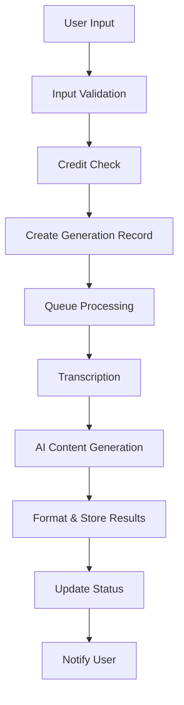

# ContentMultiplier.io Architecture

This document describes the system architecture, design patterns, and technical decisions for ContentMultiplier.io.

## Table of Contents

- [System Overview](#system-overview)
- [Technology Stack](#technology-stack)
- [Architecture Patterns](#architecture-patterns)
- [Database Design](#database-design)
- [API Design](#api-design)
- [Frontend Architecture](#frontend-architecture)
- [Authentication & Authorization](#authentication--authorization)
- [Content Generation Pipeline](#content-generation-pipeline)
- [Deployment Architecture](#deployment-architecture)
- [Security Considerations](#security-considerations)
- [Performance Optimizations](#performance-optimizations)
- [Monitoring & Observability](#monitoring--observability)

## System Overview

ContentMultiplier.io is a SaaS application that transforms various content inputs (YouTube videos, audio files, text) into 10+ different content formats using AI. The system is built with a modern, scalable architecture that supports real-time processing and user management.

### Core Features

- **Multi-Input Processing**: YouTube URLs, audio uploads, text input
- **AI Content Generation**: 10 different output formats per input
- **User Management**: Authentication, subscription tiers, credit system
- **Real-time Processing**: Live progress updates and status tracking
- **Payment Integration**: Stripe for subscription management

## Technology Stack

### Frontend

- **Framework**: Next.js 14 (App Router)
- **Language**: TypeScript (strict mode)
- **Styling**: Tailwind CSS
- **UI Components**: shadcn/ui + Radix UI
- **State Management**: React hooks + Context
- **Animations**: Framer Motion

### Backend

- **Runtime**: Node.js 20+
- **Framework**: Next.js API routes
- **Database**: Supabase (PostgreSQL)
- **Authentication**: Supabase Auth
- **File Storage**: Supabase Storage
- **AI Integration**: OpenAI GPT-4 + Whisper

### Infrastructure

- **Hosting**: Vercel
- **CDN**: Vercel Edge Network
- **Database**: Supabase (managed PostgreSQL)
- **Monitoring**: Vercel Analytics + custom metrics
- **CI/CD**: GitHub Actions

### Development Tools

- **Testing**: Jest + Playwright + Testing Library
- **Linting**: ESLint + Prettier
- **Type Checking**: TypeScript
- **Code Quality**: SonarCloud (planned)

## Architecture Patterns

### 1. Server-Side Rendering (SSR) with App Router

```typescript
// app/dashboard/page.tsx
export default async function DashboardPage() {
  const user = await getCurrentUser();
  const credits = await getUserCredits(user.id);

  return <DashboardInterface user={user} credits={credits} />;
}
```

**Benefits:**

- Better SEO and performance
- Reduced client-side JavaScript
- Secure server-side data fetching

### 2. Server Actions Pattern

```typescript
// app/actions/generation.ts
export async function generateContent(formData: FormData) {
  'use server';

  const user = await getCurrentUser();
  const input = validateInput(formData);

  return await processGeneration(user.id, input);
}
```

**Benefits:**

- Type-safe server-side operations
- Automatic request/response handling
- Built-in CSRF protection

### 3. Repository Pattern for Data Access

```typescript
// lib/repositories/user-repository.ts
export class UserRepository {
  async findById(id: string): Promise<User | null> {
    const { data } = await supabase
      .from('users')
      .select('*')
      .eq('id', id)
      .single();

    return data;
  }
}
```

**Benefits:**

- Centralized data access logic
- Easy to mock for testing
- Consistent error handling

### 4. Factory Pattern for Content Generation

```typescript
// lib/generators/content-factory.ts
export class ContentGeneratorFactory {
  static create(type: ContentType): ContentGenerator {
    switch (type) {
      case 'twitter':
        return new TwitterGenerator();
      case 'linkedin':
        return new LinkedInGenerator();
      // ... other generators
    }
  }
}
```

**Benefits:**

- Easy to add new content types
- Consistent interface across generators
- Testable individual components

## Database Design

### Core Tables

#### Users Table

```sql
CREATE TABLE users (
  id UUID PRIMARY KEY DEFAULT gen_random_uuid(),
  email TEXT UNIQUE NOT NULL,
  subscription_tier TEXT NOT NULL DEFAULT 'FREE',
  stripe_customer_id TEXT,
  created_at TIMESTAMP WITH TIME ZONE DEFAULT NOW(),
  updated_at TIMESTAMP WITH TIME ZONE DEFAULT NOW()
);
```

#### Credits Table

```sql
CREATE TABLE credits (
  id UUID PRIMARY KEY DEFAULT gen_random_uuid(),
  user_id UUID REFERENCES users(id) ON DELETE CASCADE,
  credits_remaining INTEGER NOT NULL DEFAULT 5,
  credits_total INTEGER NOT NULL DEFAULT 5,
  resets_at TIMESTAMP WITH TIME ZONE NOT NULL,
  created_at TIMESTAMP WITH TIME ZONE DEFAULT NOW(),
  updated_at TIMESTAMP WITH TIME ZONE DEFAULT NOW()
);
```

#### Generations Table

```sql
CREATE TABLE generations (
  id UUID PRIMARY KEY DEFAULT gen_random_uuid(),
  user_id UUID REFERENCES users(id) ON DELETE CASCADE,
  input_type TEXT NOT NULL CHECK (input_type IN ('youtube', 'audio', 'text')),
  input_url TEXT,
  transcript TEXT NOT NULL,
  outputs JSONB NOT NULL,
  status TEXT NOT NULL DEFAULT 'pending' CHECK (status IN ('pending', 'processing', 'completed', 'failed')),
  created_at TIMESTAMP WITH TIME ZONE DEFAULT NOW(),
  updated_at TIMESTAMP WITH TIME ZONE DEFAULT NOW()
);
```

### Row Level Security (RLS)

All tables implement RLS policies to ensure users can only access their own data:

```sql
-- Users can only see their own data
CREATE POLICY "Users can view own data" ON users
  FOR SELECT USING (auth.uid() = id);

-- Credits are user-specific
CREATE POLICY "Users can view own credits" ON credits
  FOR SELECT USING (auth.uid() = user_id);
```

## API Design

### RESTful Endpoints

#### Content Generation

- `POST /api/generate` - Start content generation
- `GET /api/generation/[id]` - Get generation status and results

#### Authentication

- `POST /api/auth/logout` - Logout user
- `GET /api/auth/user` - Get current user

#### Worker

- `POST /api/worker/process` - Process pending generations (cron)

### Request/Response Patterns

#### Standard Response Format

```typescript
interface ApiResponse<T> {
  success: boolean;
  data?: T;
  error?: string;
  message?: string;
}
```

#### Error Handling

```typescript
// Consistent error responses
{
  "success": false,
  "error": "Validation failed",
  "details": {
    "email": "Invalid email format"
  }
}
```

## Frontend Architecture

### Component Structure

```
components/
├── ui/                    # Reusable UI components (shadcn/ui)
├── dashboard/             # Dashboard-specific components
│   ├── upload/           # Upload form components
│   ├── BillingDisplay.tsx
│   └── OutputDisplay.tsx
├── landing/              # Landing page components
└── ErrorBoundary.tsx     # Error handling
```

### State Management

#### Local State (useState)

- Form inputs
- UI toggles
- Component-specific state

#### Server State (Server Components)

- User data
- Credits information
- Generation history

#### Client State (Context)

- Authentication state
- Theme preferences
- Global UI state

### Routing Strategy

#### App Router Structure

```
app/
├── page.tsx              # Landing page
├── login/                # Authentication
├── signup/
├── dashboard/            # Protected routes
│   ├── page.tsx         # Main dashboard
│   ├── generation/[id]/ # Generation results
│   └── settings/        # User settings
└── api/                 # API routes
```

#### Route Protection

```typescript
// middleware.ts
export function middleware(request: NextRequest) {
  const isProtected = request.nextUrl.pathname.startsWith('/dashboard');

  if (isProtected && !isAuthenticated(request)) {
    return NextResponse.redirect(new URL('/login', request.url));
  }
}
```

## Authentication & Authorization

### Supabase Auth Integration

#### Authentication Flow

1. User signs up with email/password
2. Supabase sends verification email
3. User clicks verification link
4. JWT token stored in httpOnly cookie
5. Middleware validates token on protected routes

#### Session Management

```typescript
// lib/auth.ts
export async function getCurrentUser() {
  const supabase = createServerClient();
  const {
    data: { user },
  } = await supabase.auth.getUser();
  return user;
}
```

### Authorization Levels

#### Subscription Tiers

- **FREE**: 5 credits/month, basic features
- **STARTER**: 50 credits/month, $39/month
- **PRO**: 200 credits/month, $99/month
- **TEAM**: 500 credits/month, $199/month

#### Credit System

- Each generation consumes 1 credit
- Credits reset monthly
- Atomic credit deduction prevents race conditions

## Content Generation Pipeline

### Processing Flow



### AI Integration

#### OpenAI GPT-4 for Content Generation

```typescript
const response = await openai.chat.completions.create({
  model: 'gpt-4',
  messages: [
    { role: 'system', content: systemPrompt },
    { role: 'user', content: transcript },
  ],
  temperature: 0.7,
  max_tokens: 2000,
});
```

#### Whisper for Audio Transcription

```typescript
const transcription = await openai.audio.transcriptions.create({
  file: audioFile,
  model: 'whisper-1',
  response_format: 'text',
});
```

### Content Outputs

Each generation produces 10 different formats:

1. **Twitter Posts** (5x) - 280 characters with hashtags
2. **LinkedIn Posts** (3x) - Professional tone, up to 1,300 chars
3. **Instagram Captions** (2x) - Engaging tone, up to 2,200 chars
4. **Blog Article** (1x) - SEO-optimized, 1,500-2,500 words
5. **Email Newsletter** (1x) - Subject line + 500-word body
6. **Quote Graphics** (5x) - Text for design tools
7. **Twitter Thread** (1x) - 8-12 connected tweets
8. **Podcast Show Notes** (1x) - Bullet points with timestamps
9. **Video Script Summary** (1x) - Key talking points
10. **TikTok/Reels Hooks** (5x) - Attention-grabbing hooks

## Deployment Architecture

### Vercel Deployment

#### Build Process

1. GitHub push triggers deployment
2. Vercel builds Next.js application
3. Static assets deployed to CDN
4. Serverless functions deployed globally

#### Environment Configuration

```typescript
// next.config.js
const nextConfig = {
  env: {
    CUSTOM_KEY: process.env.CUSTOM_KEY,
  },
  async headers() {
    return [
      {
        source: '/(.*)',
        headers: securityHeaders,
      },
    ];
  },
};
```

### Database Hosting

#### Supabase Configuration

- Managed PostgreSQL database
- Automatic backups and point-in-time recovery
- Real-time subscriptions for live updates
- Built-in authentication and storage

## Security Considerations

### Data Protection

#### Input Validation

```typescript
// lib/validation.ts
export const generateContentSchema = z.object({
  input_type: z.enum(['youtube', 'audio', 'text']),
  input_url: z.string().url().optional(),
  input_text: z.string().min(100).max(50000).optional(),
});
```

#### File Upload Security

- File type validation (MP3, WAV, M4A only)
- File size limits (25MB max)
- Virus scanning (planned)
- Secure file storage in Supabase

#### API Security

- Rate limiting per user
- CSRF protection on forms
- Input sanitization
- SQL injection prevention (parameterized queries)

### Authentication Security

#### JWT Token Management

- Short-lived access tokens
- Secure httpOnly cookies
- Automatic token refresh
- Secure logout with token invalidation

#### Password Security

- Supabase handles password hashing
- Minimum password requirements
- Account lockout after failed attempts

## Performance Optimizations

### Frontend Performance

#### Next.js Optimizations

- Server-side rendering for better SEO
- Image optimization with next/image
- Code splitting and lazy loading
- Static generation where possible

#### Caching Strategy

- API response caching
- Static asset caching
- CDN distribution
- Browser caching headers

### Backend Performance

#### Database Optimizations

- Proper indexing on frequently queried columns
- Connection pooling
- Query optimization
- Read replicas for scaling (planned)

#### AI Processing

- Async processing with job queues
- Progress tracking for long operations
- Error handling and retries
- Rate limiting for API calls

## Monitoring & Observability

### Application Monitoring

#### Vercel Analytics

- Page view tracking
- Performance metrics
- Error tracking
- User behavior analytics

#### Custom Metrics

```typescript
// lib/analytics.ts
export function trackGeneration(userId: string, inputType: string) {
  // Track generation events
  analytics.track('content_generated', {
    userId,
    inputType,
    timestamp: new Date().toISOString(),
  });
}
```

### Error Handling

#### Error Boundaries

```typescript
// components/ErrorBoundary.tsx
export class ErrorBoundary extends Component {
  componentDidCatch(error: Error, errorInfo: ErrorInfo) {
    // Log error to monitoring service
    console.error('Error caught by boundary:', error, errorInfo);
  }
}
```

#### Logging Strategy

- Structured logging with context
- Error aggregation and alerting
- Performance monitoring
- User action tracking

## Future Considerations

### Scalability

#### Horizontal Scaling

- Microservices architecture (planned)
- Event-driven architecture
- Message queues for processing
- Load balancing

#### Database Scaling

- Read replicas for queries
- Database sharding (if needed)
- Caching layer (Redis)
- Data archiving strategy

### Feature Extensions

#### Planned Features

- Team collaboration
- Custom brand voice
- Batch processing
- API access for developers
- Advanced analytics
- Content scheduling

#### Technical Debt

- Migration to microservices
- Enhanced monitoring
- Performance optimizations
- Security hardening

---

This architecture document is living and will be updated as the system evolves. For questions or clarifications, please refer to the codebase or create an issue.
